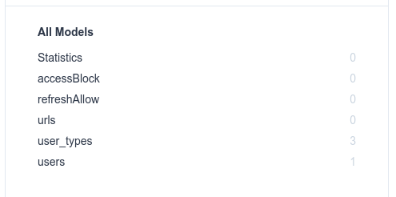

# Wooz Shortener App - backend


## Table of Content

- [Wooz Shortener App - backend](#wooz-shortener-app---backend)
  - [Table of Content](#table-of-content)
  - [Description](#description)
  - [Project Challange](#project-challange)
  - [How to run](#how-to-run)
    - [On Local Development](#on-local-development)
    - [On Production](#on-production)
  - [Environment Variable](#environment-variable)
  - [Database and Caching](#database-and-caching)
    - [Database Migration \& Seed](#database-migration--seed)
  - [Postman Api Collection](#postman-api-collection)
  - [Routing Table](#routing-table)
  - [The story how do i get the algorithm](#the-story-how-do-i-get-the-algorithm)
    - [Shortener Algorithm / random text](#shortener-algorithm--random-text)
  - [Project Stack](#project-stack)
    - [FrontEnd](#frontend)
    - [Backend](#backend)
  - [Frontend Project](#frontend-project)

## Description

Woozify is a service that allows users to shorten URLs and generate QR codes. The features include shortening URLs, providing engagement analytics, and a QR Maker. The pricing types are guest, free, and paid.

## Project Challange

Requirement :

- Store long and short URLs: ✅
- Generate unique short URLs: ✅
- Handle redirection: ✅
- Cache frequently accessed URLs: ✅

Optional features:

- Track clicks on shortened URLs ✅
- Implement rate limiting to prevent abuse ✅

## How to run

### On Local Development  

1. Clon this repo
2. Setup the Database and Caching
3. Setup the Environment Variable
4. Install Dependencies ``yarn install``
5. Run Database Migration & Seed
6. Start the app

### On Production

There are various ways to run the application in production. Every detailed step is important, and you also need some knowledge about your cloud provider to run this app. For this, you can read the documentation provided by your cloud provider.

## Environment Variable

For the environment variable there is file reference at root this project named ``.env.example``, use this as the reference to configuring environment variable for this app.

## Database and Caching

This project is has initiated with PostgreSQL DB, and Redis as the caching. and if you have Docker Engine or Docker Desktop installed on your development environment. you can setup using docker compose from this project. **the credential also available at** ``docker-compose.yml``. If not, you have to setup it manually and fill the environment variable that available on ``.env.example``.

> After correctly setting up the database, please follow the configuration below to run the application features correctly.

### Database Migration & Seed

To run the database migration, you need to correctly set up the database first and install package dependencies with the command below. This is necessary for running Prisma Studio

```shell
yarn install
```

Because all users depend on user_types, it’s necessary to add a record to user_type first. We also need a user template for guests, which you can check in the prisma folder. the file named ``prisma.seed.ts``.

```shell
npx prisma migrate deploy
npx prisma db seed
```

To check if you have correctly run the database migration and seeding (inserting template records), you can verify it via Prisma Studio. If the records show ``user_type`` as ``3`` and ``users`` as ``1``, it means you have correctly executed the database migration and seeding. you can open prisma studio with command below :

```shell
npx prisma studio
```



## Postman Api Collection

[](https://documenter.getpostman.com/view/31887036/2s9YsT797i)

The API documentation is available on the Postman API Documenter. References about the ``params``, ``query``, or ``body`` requests are also available there. Alternatively, you can directly import from docs/postman-api-collection/Wooz.postman_collection.json into your Postman app.

## Routing Table

This routing table is a reference for those who want to test the API and need to know if the API requires authentication. So, this is the reference.

> Note: Attach the Authorization as a Bearer token in the header.

| **Description** | **Route** | **Method** | **Access Token** | **Refresh Token** |
|---|---|:---:|:---:|:---:|
| User register | /auth/register | post |  |  |
| User login | /auth/login | post |  |  |
| Refresh token | /auth/refresh | post |  | require |
| User logout | /auth/remove-session | delete |  | require |
| Create Short url | /shortener | post | require |  |
| Get list url with analytic | /analytic | get | require |  |
| Get list url | /shortener | get | require |  |
| Update short url | /shortener/:url_short | patch | require |  |
| Delete short url | /shortener/:url_short | delete | require |  |
| Get Redirect url | /shortener/:url_short | get |  |  |
| Create Short url guest | /shortener/guest | post |  |  |
| Delete short url guest | /shortener/guest/:url_short/:session_id | delete |  |  |

## The story how do i get the algorithm

The algorithm is very simple. I have faced a problem with printing text in the array. It should print the letter either ``a`` or ``b`` from the array ``["a", "b"]`` without manually selecting them, and it should change every time. In JavaScript, there is an object named ``Math`` that can be used for calculations. Instead of using ``array[0]`` to print the letter ``a``, which can't change every time, I needed to find a way to get the letter automatically.

Firstly, I needed to get the array index automatically. There is a property called ``length`` in the ``Array`` object in JavaScript that can be used to get the array length, so ``["a","b"].length`` will result in ``2``. Cool, but it's not the index. In JavaScript, array indices start from ``0``, but for now, it's enough. Next, I needed to convert it into an array index of array ``["a","b"]``. Instead of using ``["a","b"].length-1``, which can't change automatically, I used ``Math.random()``.

``random()`` is a method from the ``Math`` object. It will return a number from ``0`` until ``0.999...``. So, how do I get the index of that array automatically? To be honest, the first time I faced this, it was hard for me. Keep in mind, ``["a","b"].length`` will return ``2``, and let's call it ``arrayLength``. To be able to do this, I looked for many resources until I found the formula. Then I multiplied ``Math.random()`` with ``arrayLength``. It will return from ``0.00001...`` to `1.9999...`. Okay, we are almost there. But how do I get the index of that array?

Finally, there is a method called ``floor()`` from the ``Math`` object that rounds down the number. Ta-da! ✨ I got the index with ``Math.floor(Math.random() * arrayLength)``. Let me explain.

The ``["a","b"].length``, or what we have called ``arrayLength``, has a value of ``2``.

If ``Math.random()`` has a value of ``0.7824245379950878``, then when multiplied by ``arrayLength``, it will result in ``1.564849076``. We can round down with ``Math.floor()``, and it will become ``1``.

If ``Math.random()`` has a value of ``0.4330327180327569``, then when multiplied by ``arrayLength``, it will result in ``0.866065436``. We can round down with ``Math.floor()``, and it will become ``0``.

If ``Math.random()`` has a value of ``0.6543374656326733``, then when multiplied by ``arrayLength``, it will result in ``1.308674931``. We can round down with ``Math.floor()``, and it will become ``1``.

If ``Math.random()`` has a value of ``0.2254911327358402``, then when multiplied by ``arrayLength``, it will result in ``0.450982265``. We can round down with ``Math.floor()``, and it will become ``0``.

Now, I was able to print ``a`` or ``b`` automatically with this formula. The final result will be:

```javascript
const theArray = ["a","b"]
const random = Math.random()
const arrayLength = theArray.length
const theIndex = Math.floor(random * arrayLength)

console.log("random ", random)
console.log("arrayLength ", arrayLength)
console.log("theIndex ", theIndex)
console.log("result ", theArray[theIndex])
```

### Shortener Algorithm / random text

So, for the case of “Shortener Algorithm / random text”, I just generate from A-Z, a-z, and 0-9. From my algorithm, then I implement it to the random text with **4** digit letters. It will have **62^4 = 14,776,336 unique string combinations.**

So, as the file ``src/wooz/wooz.service.ts``, the final result will be:

```javascript
  public generateFourLetter(): string {
    const letters = this.generateLetter();

    let shortUrl: string = '';

    for (let index = 0; index <= 3; index++) {
      const letterIndex = Math.floor(Math.random() * letters.length);
      const newLetter = letters[letterIndex];

      shortUrl += newLetter;
    }

    return shortUrl;
  }
```

## Project Stack

### FrontEnd

- NextJS + TypeScript
- Other necessary libraries

### Backend

- NestJS + TypeScript
- Postgres + Redis
- Docker
- Other necessary libraries

## Frontend Project

<https://github.com/rizqikazukun/903798df-a654-4a94-9a90-f34acfda5204>
